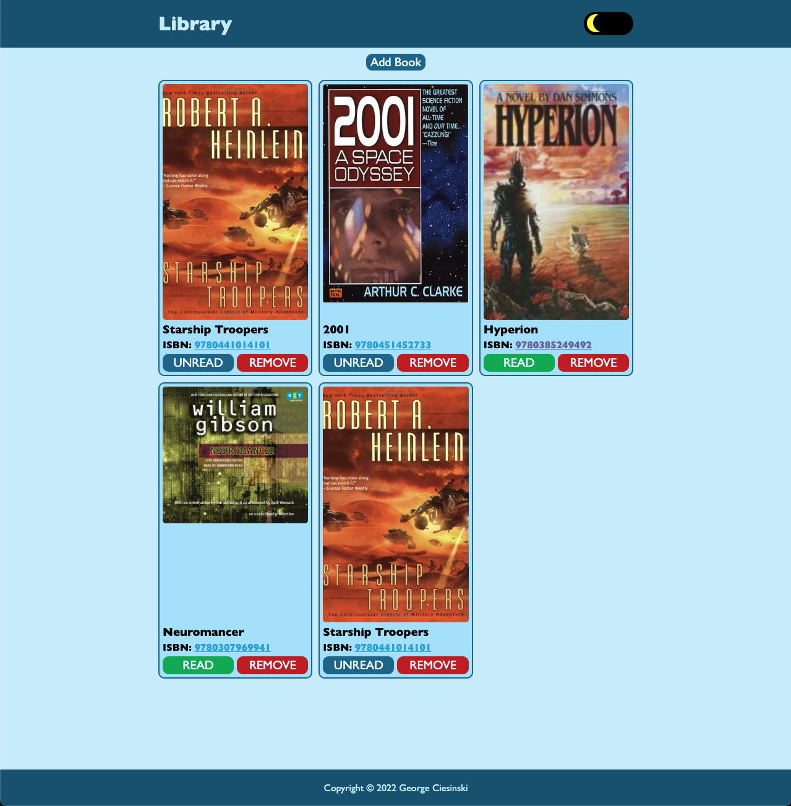
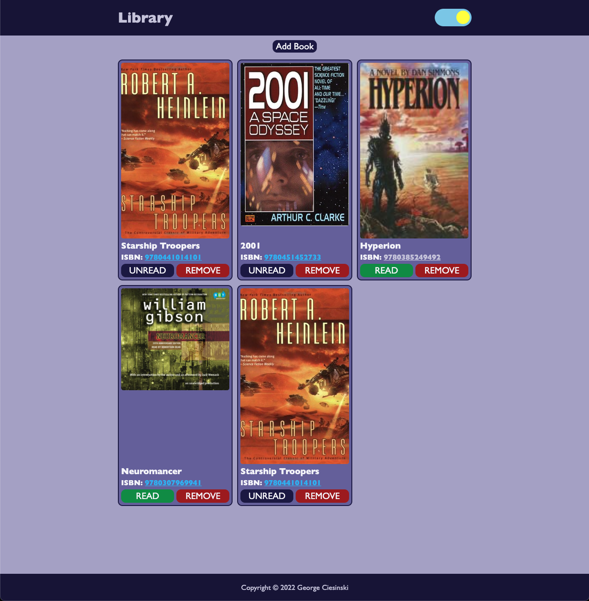
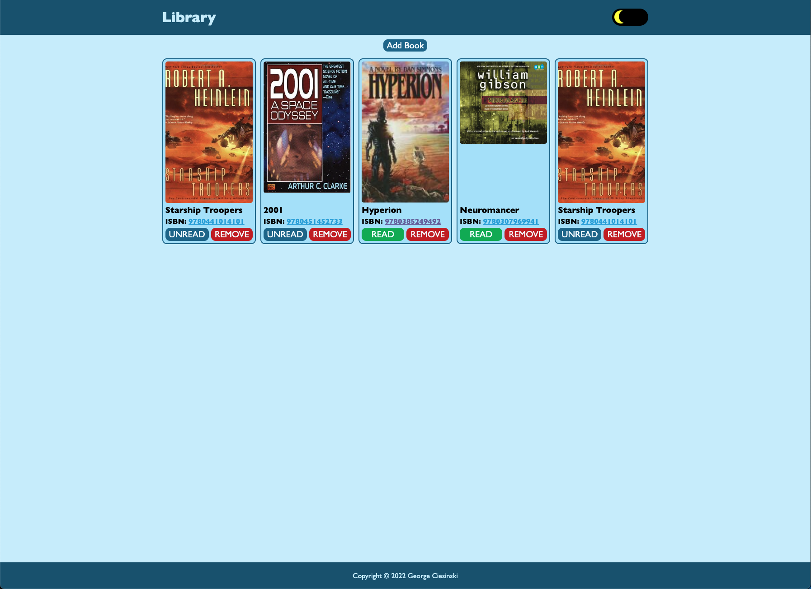

# library-app
Library app built as an assignment for The Odin Project 

## Project Information
This app makes use of object constructors to create new books and load them into the bookshelf. 

## Features

### Track Books
Add and remove books from the library by providing a title, ISBN, or both. The Read/Unread button allows you to keep track of whether the book has been read or not. 

### Dark/Light mode toggle
The dark/light mode toggles the color scheme of the website to make it easier on the eyes when viewed in the dark. 

### Detects User Preference
The app detects whether the user is using dark/light mode on their computer and adjusts to match this automatically. It can still be toggled afterwards. 

### Fetch Info from Open Library
Books can be added using an ISBN only. Using an ISBN allows the Library App to fetch the title and cover from Open Library so it can be displayed in the app.

### Responsive Layout
The app resizes the books depending on the screen it is viewed in. 

## How to Run this Locally
Simply clone the repo and open `index.html` in your browser of choice. 

## Problems Encountered & Solutions

### Dark Mode & Toggle
My main difficulty with this project was implementing a dark mode. This is my first dark mode in any project. I couldn't decide at first if I wanted a CSS only dark mode, or if I wanted to use JS. After spending some time researching it I realized that the CSS only dark mode would not be well suited for the project. Since it worked by placing the dark-mode input first in the webpage and using the CSS selector `#dark-mode:checked ~ *`, it meant that I had to structure the page in a specific way for it to work, and would add difficulties styling it so the toggle appeared where I wanted it. In short, it would take a ton of code.

I researched further and found an [article](https://dev.to/ananyaneogi/create-a-dark-light-mode-switch-with-css-variables-34l8) by [Ananya Neogi](https://dev.to/ananyaneogi) which showed how to make a JS dark mode. This article made it really easy to understand, and it seemed to achieve the same thing as the CSS only method with only a few lines of code. After implementing the JS method, I was really happy with the result. 

Lastly, I added dark mode detection following [this stack overflow](https://stackoverflow.com/questions/56393880/how-do-i-detect-dark-mode-using-javascript) answer so that the site uses the user's default theme. 

### Custom Checkboxes
I was surprised to learn that default checkboxes take a bit of work to style in CSS. I followed [this guide](https://moderncss.dev/pure-css-custom-checkbox-style/) to get the results I was looking for, and so that I can style my checkbox with light/dark mode.

### Grid Layout
I experienced some difficulty building a dynamic grid. While the first row worked nicely, the subsequent rows were the wrong size. I ended up opening a stack [overflow question](https://stackoverflow.com/questions/74437533/grid-is-not-sizing-correctly-in-row-direction) and after some further research, I resolved the problem myself. Feel free to check out the question if you want to see the issue in more detail and the solution. 

### Fetching Book Data
I used the [Open Library](https://openlibrary.org/) API to fetch book data such as the title and cover image using the ISBN. It took a bit of research, but I learned how to fetch the `json` from the API and use an async function to update the bookshelf with the data. Based on this issue, I need to study the [promise](https://developer.mozilla.org/en-US/docs/Web/JavaScript/Reference/Global_Objects/Promise) in more detail. 

### Error Catching
I noticed there was some errors that always get logged. For example, if someone enters a bad ISBN, Open Library returns a 404 error which is logged into the console. As this is expected, I wanted to display an alert and hide the error. Unfortunately, this looks like it is a function built into the browsers and errors can only be caught, but not hidden. 

## License
MIT license. See the attached license for more information. 